# Investment Portfolio Tracking App

## Introduction

This document describes the investment portfolio tracking app developed for the Addepar onsite interview process. The app retrieves investment data from provided JSON files and displays them in a user-friendly interface.

### Demo

## Features

- Lists all investments retrieved from the JSON files.
- Provides a detailed view of each investment when selected from the list.
- Supports handling different JSON scenarios:
  - Valid investments (investments.json)
  - Empty investment list (investments-empty.json)
  - Malformed JSON data (investments-malformed.json)
  - Error response (investments-error.json)

### Screenshots

#### Light Theme
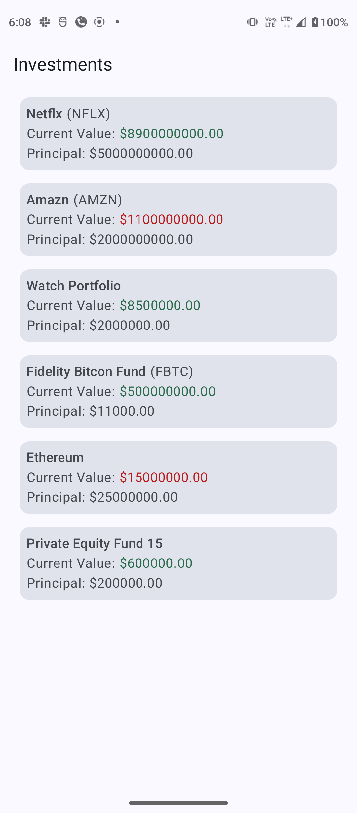 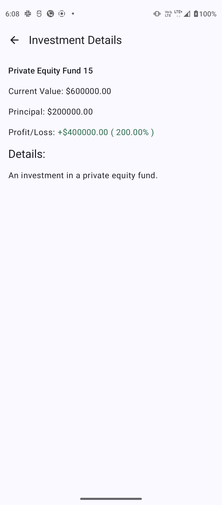 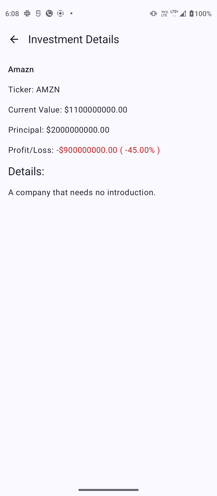 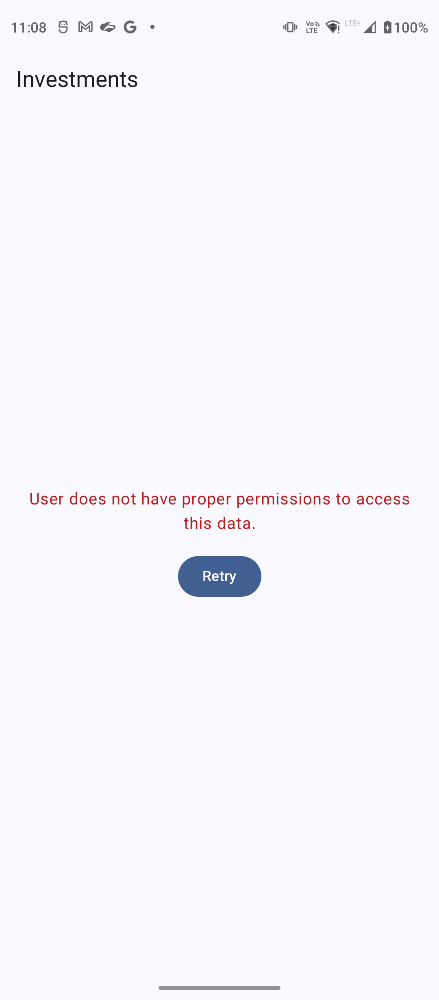 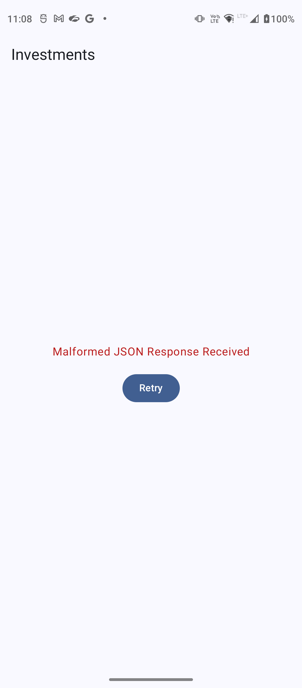 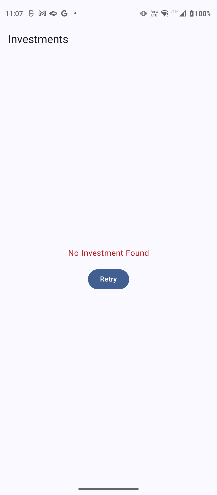

#### Dark Theme

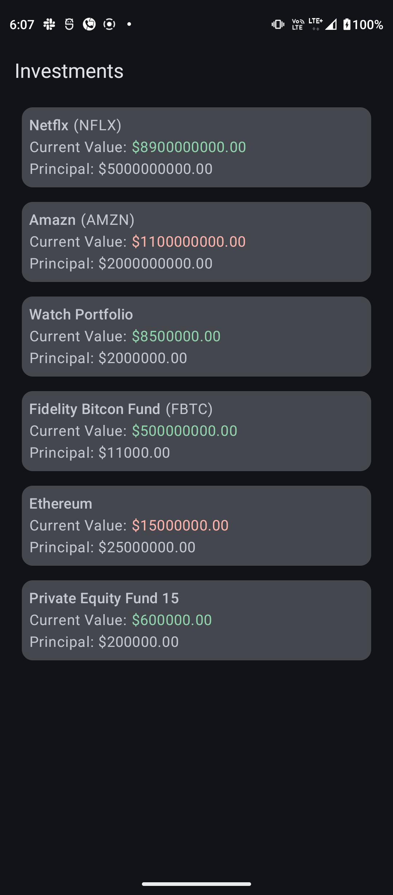 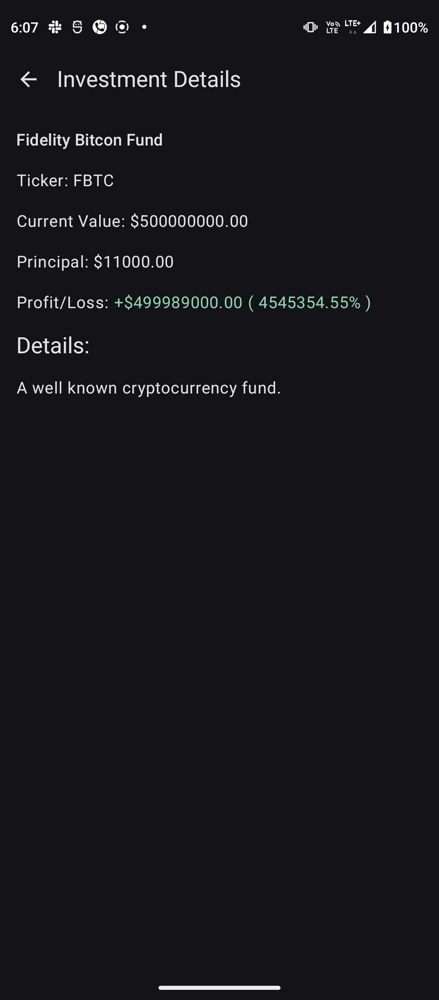 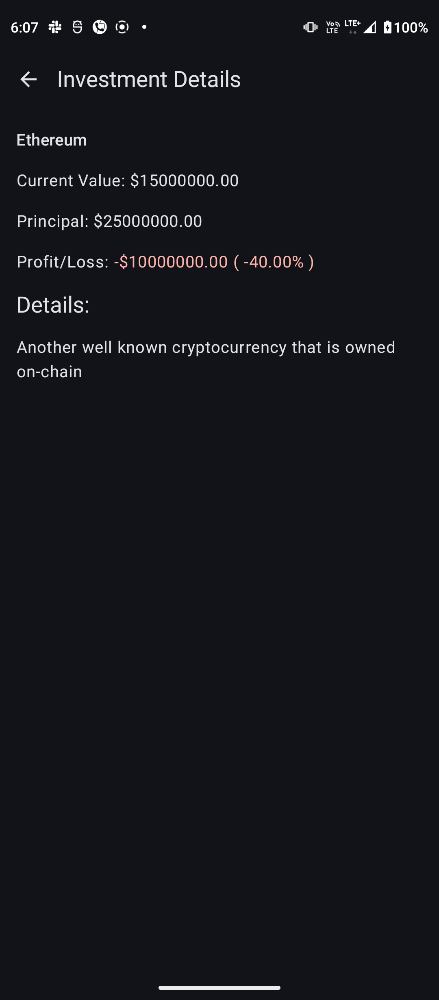 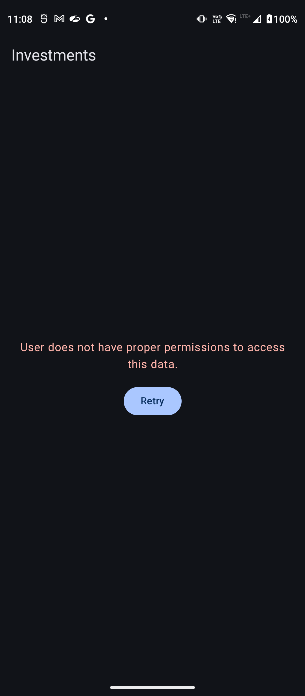 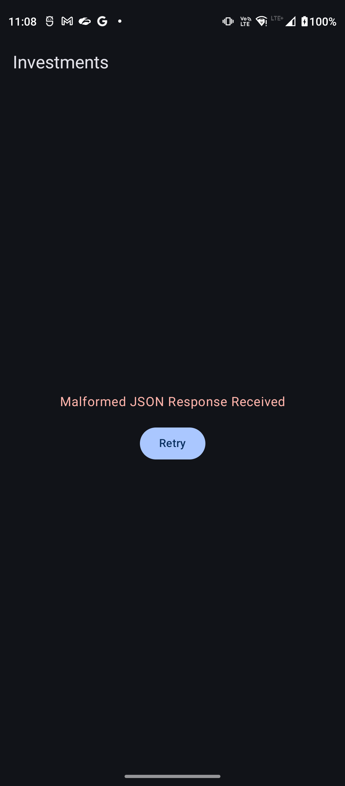 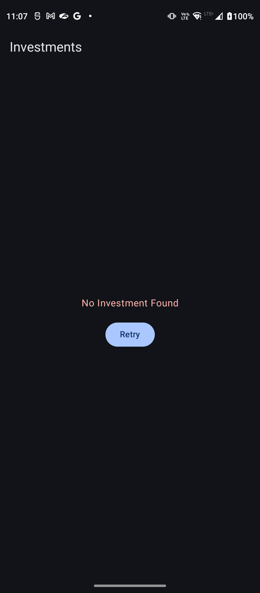

## Development Environment

- Programming language: Kotlin
- Build system: Gradle
- IDE: Android Studio

## Running the App

1. Clone or download the project.
2. Open the project in your IDE.
3. Ensure you have the necessary dependencies configured in your build.gradle file.
4. Standard Android libraries
5. JSON parsing library (e.g., Gson)
6. Build the project.
7. Run the app on an emulator or physical device.

## Project Structure

### Overview
The project adheres to a clean architecture approach, separating concerns into distinct layers: data, domain, and presentation.

### Key Points:
- **Clear separation of concerns:** The project follows a layered architecture with distinct responsibilities for each layer.
- **Dependency injection:** The di package adds dependency injection, promoting testability and maintainability.
- **Data-first approach:** The data layer is well-defined, handling data retrieval and parsing.
- **Domain layer:** While present, the domain layer might be expanded to encapsulate business logic and rules.
- **UI layer:** The presentation layer is organized with clear separation of concerns between different screens and components.

This structure provides a solid foundation for further development and scalability.

## Explanation of Key Code Components

### Data Layer
- **InvestmentRepoImpl:** Handles fetching investment data from JSON files stored in the app's assets.
  - Utilizes AssetJsonReader to read JSON content.
  - Parses JSON data into Investment objects using Gson.
  - Implements robust error handling for various scenarios (e.g., null investments, empty lists, malformed data, JSON parsing errors) by throwing custom exceptions.
  - Employs Flow and Dispatchers.IO for asynchronous data fetching and handling.
  - Injects Context for asset access using Dagger Hilt.

### Domain Layer
- **Investment:** Represents an investment with properties like name, ticker, value, principal, and details.
- **InvestmentRepo:** Defines the contract for retrieving investment data.

### Presentation Layer
- **InvestmentDetailsScreen:** Displays detailed investment information, including calculations for profit/loss and percentage.
  - Uses LaunchedEffect to perform calculations on a background thread for improved performance.
  - Formats numerical values for better readability.
- **InvestmentItem:** Displays a concise view of an investment within a list.
  - Performs similar calculations as InvestmentDetailsScreen for displaying profit/loss information.

### Additional Considerations
- **Dependency Injection:** Leverages Dagger Hilt for managing dependencies.
- **Error Handling:** Implements comprehensive error handling for JSON parsing and data validation.
- **Asynchronous Operations:** Utilizes Kotlin Coroutines for background tasks.
- **UI Optimization:** Employs LaunchedEffect to offload calculations from the main thread.
- **Data Formatting:** Formats numerical values for better user experience.

By combining these components, the app effectively fetches, processes, and displays investment data while maintaining a clean and efficient architecture.

## Additional Notes

This project provides a foundational implementation for an investment portfolio tracking app. It demonstrates core concepts like data fetching, parsing, UI display, and error handling.

### Potential Enhancements:

- **Data Persistence:** Consider using local storage (e.g., Room) to persist investment data for offline availability and data synchronization.
- **UI Enhancements:** Improve the user interface with animations, transitions, and more interactive elements.
- **Performance Optimization:** Optimize UI rendering and data processing for large datasets.
- **Testing:** Expand test coverage to include UI tests and performance testing.
- **Error Handling:** Implement more granular error handling with specific error messages for different error scenarios.
- **Data Validation:** Add stricter validation for investment data to prevent invalid inputs.

This project can serve as a starting point for building a more comprehensive and robust investment tracking application.

## Disclaimer

This app is a sample project developed for an interview process. It may not represent all best practices for production-ready applications.
